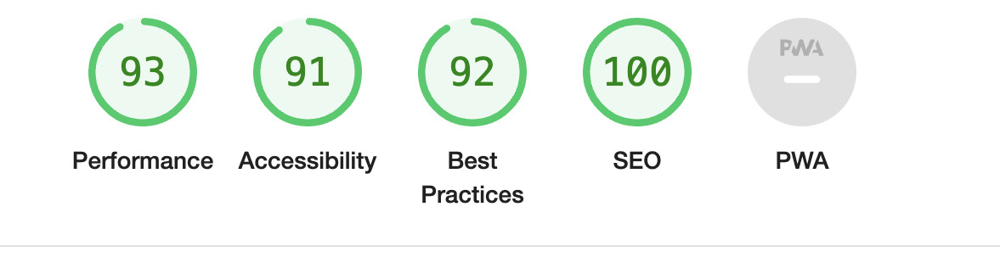

# Sports Quiz 2023

## Welcome

Our primary aim is to provide an engaging and educational platform where sports enthusiasts can challenge their knowledge, explore the world of sports through an interactive Arena Map, and foster a vibrant community of like-minded fans. We strive to create an inclusive and user-friendly environment that appeals to both newcomers and seasoned sports aficionados, promoting learning, competition, and the joy of sports trivia. With a commitment to accessibility, usability, and future enhancements, our goal is to make the Sports Quiz Website the go-to destination for sports enthusiasts seeking fun and knowledge.

[View Sports Quiz 2023 on Github](https://github.com/Deesingh92/MSP2-SportsQuiz2023)

[View the live website here](https://deesingh92.github.io/MSP2-SportsQuiz2023/)

- - -

- [Sports Quiz 2023](#Sports-Quiz-2023)
  - [User Experience (UX)](#user-experience-ux)
    - [Initial Discussion](#initial-discussion)
      - [Key Information for the site](#key-information-for-the-site)
    - [User Stories](#user-stories)
      - [Client Goals](#client-goals)
      - [First Time Visitor Goals](#first-time-visitor-goals)
      - [Returning Visitor Goals](#returning-visitor-goals)
      - [Frequent Visitor Goals](#frequent-visitor-goals)
  - [Design](#design)
    - [Colour Scheme](#colour-scheme)
    - [Typography](#typography)
    - [Imagery](#imagery)
    - [Wireframes](#wireframes)
    - [Features](#features)
    - [Accessibility](#accessibility)
  - [Technologies Used](#technologies-used)
    - [Languages Used](#languages-used)
    - [Frameworks, Libraries \& Programs Used](#frameworks-libraries--programs-used)
  - [Deployment \& Local Development](#deployment--local-development)
    - [Deployment](#deployment)
    - [Local Development](#local-development)
      - [How to Fork](#how-to-fork)
      - [How to Clone](#how-to-clone)
  - [Testing](#testing)
  - [Credits](#credits)
    - [Code Used](#code-used)
    - [Content](#content)
    - [Media](#media)
    - [Acknowledgement](#acknowledgement)

## User Experience (UX)

### Initial Discussion

Welcome to the Sports Quiz Website! This repository houses the code and assets for a dynamic sports trivia quiz platform that caters to sports enthusiasts of all levels. Whether you're a casual fan or a sports guru, this website offers an engaging and challenging experience to test your knowledge and explore the world of sports.

#### Features

- Interactive Quiz: Test your sports knowledge with a wide range of trivia questions spanning different sports, eras, and difficulty levels.

- Arena Map: Explore an interactive Google Maps API-powered map featuring iconic sports arenas from around the world.

- User-Friendly Design: Enjoy a seamless and intuitive user interface designed for easy navigation and engagement.

- Responsive: Access the quiz and content on various devices, including desktops, tablets, and smartphones.

- Score Tracking: Keep track of your quiz scores and compare them with other users on the global leaderboard.

- User Accounts: Create and customize user profiles, track quiz history, and compete with friends.

- Google Maps API Integration
Our website leverages the Google Maps API to provide an immersive Arena Map experience. Users can explore and learn about legendary sports venues, access historical data, and gain insights into the world of sports architecture and history.

#### Key Information for the site

- The Sports Quiz is an engaging web application that offers sports enthusiasts a chance to challenge their sports trivia knowledge. With multiple difficulty levels, randomized questions, and a user-friendly interface, it provides an enjoyable and educational experience for users of all expertise levels. Explore a wide range of sports topics, answer multiple-choice questions, and track your score. The quiz is fully responsive, ensuring a seamless experience on desktop, tablet, and mobile devices.
- Our Sports Quiz website takes your sports experience to the next level with an interactive map powered by the Google Maps API. Discover the biggest sports arenas around the globe, from iconic football stadiums to massive basketball arenas. With marker clusters, you can easily navigate and explore these world-renowned venues. Click on markers to view detailed information about each arena, including capacity, location, and notable events hosted. Whether you're a sports fan planning future trips or simply curious about these legendary venues, our Arena Map adds an exciting dimension to your sports trivia adventure.

### User Stories

#### Client Goals

- User Engagement: The client aims to create an engaging and interactive platform that captivates sports enthusiasts and trivia lovers. They want users to spend quality time on the website, enjoying the quiz, exploring sports arenas, and competing for high scores.

- Educational Value: The client wants the website to be more than just a game. They aim to provide valuable sports knowledge to users by crafting informative and diverse quiz questions that cover a wide range of sports topics.

- Responsive Design: Ensuring a seamless user experience across various devices is a top priority. The client wants the website to be fully responsive, allowing users to play the quiz and explore sports arenas on desktops, tablets, and mobile devices.

- User-Friendly Interface: User-friendliness is key. The client aims to create an intuitive and easy-to-navigate interface, making it simple for users to start playing, choose difficulty levels, and access information about sports venues.

- Visual Appeal: The client wants the website to be visually appealing, with eye-catching graphics and a clean layout. This includes using images, icons, and maps to enhance the overall design.

- Google Maps Integration: One of the main goals is to integrate the Google Maps API effectively to showcase the world's biggest sports arenas. Users should be able to explore these venues easily and access relevant information.

- Score Tracking: The client intends to implement a score-tracking system to motivate users to continue playing and strive for higher scores. They want users to feel a sense of accomplishment as they progress through the quiz.

- Social Sharing: Encouraging users to share their quiz results and experiences on social media is a priority. The client aims to leverage social sharing to increase the website's visibility and reach a broader audience.

- Educational Content: Apart from the quiz, the client plans to include educational content about sports history, trivia, and fun facts. They hope to make the website a valuable resource for sports enthusiasts.

- Community Building: Building a community of sports fans is a long-term goal. The client envisions the website becoming a hub where users can discuss sports, share insights, and connect with like-minded individuals.

#### First Time Visitor Goals

- Discover the Website: The primary goal of first-time visitors is to discover the website and understand its purpose. They want to quickly grasp that it's a sports quiz platform.

- Learn How to Play: New visitors seek clear instructions on how to play the quiz. They want to understand the rules, difficulty levels, and how to answer questions.

- Explore Arena Map: Visitors are curious about the interactive arena map and aim to explore it. They want to see markers for major sports arenas and learn more about them.

- Select a Difficulty Level: Users intend to choose a difficulty level that matches their sports knowledge. They want to make an informed decision on whether to play an easy, medium, or hard quiz.

- Enjoy the Quiz Experience: Visitors want an enjoyable and challenging quiz experience. They aim to test their sports knowledge, answer questions, and track their score.

- Access Additional Content: Some visitors may be interested in accessing educational content related to sports history and trivia. They hope to find informative articles or fun facts.

- Connect on Social Media: New visitors who enjoy the website may want to connect with it on social media platforms. They aim to follow the website for updates and engage with the sports community.

- Share Results: If they perform well in the quiz, visitors may want to share their quiz results with friends on social media. They aim to showcase their sports knowledge and challenge others.

- Receive Support: Visitors may need assistance or have questions while navigating the website. They hope to find clear contact or support information if they encounter issues.

- Leave Feedback: Some visitors may want to provide feedback or suggestions to improve the website. They aim to find a way to share their thoughts with the website administrators.

- Explore Future Features: Curious users might be interested in any upcoming features or updates the website plans to introduce. They aim to learn about the website's future offerings.

- Access the Website Responsively: Visitors expect the website to work seamlessly on various devices, including desktop computers, tablets, and mobile phones.

#### Returning Visitor Goals

- Continue Playing and Competing: Returning visitors aim to pick up where they left off in the quiz. They want to continue playing, answering questions, and improving their scores.

- Explore New Questions: Users who have played before are interested in encountering new and challenging questions. They hope to see a fresh set of quiz questions to keep the game exciting.

- Challenge Friends: Some returning visitors want to challenge their friends to play the quiz. They aim to share the website with friends and compete to see who scores higher.

- Engage in Community Discussions: Returning visitors who enjoy the website may want to participate in community discussions or forums related to sports. They aim to connect with like-minded individuals and share insights.

- Stay Updated: Returning visitors want to stay informed about any website updates, new features, or additional content. They aim to remain engaged with the website's latest offerings.

- Refer Others: Satisfied users may refer the website to others who share their interest in sports trivia. They aim to expand the website's user base and create a community of sports enthusiasts.

- Connect on Social Media: Visitors who had a positive experience may want to connect with the website on social media platforms. They aim to follow the website's social accounts for updates and interactions.

- Provide Feedback: Returning users who have valuable feedback or suggestions for improvement hope to find a channel to share their insights with the website administrators.

- Explore Arena Map Updates: Visitors interested in sports venues may want to check for updates to the interactive arena map. They aim to discover new markers and information about sports arenas.

- Enjoy a Seamless Experience: Returning visitors expect the website to provide a consistent and responsive experience across all devices, making it easy to play the quiz and explore content.

#### Frequent Visitor Goals

- Daily Quiz Challenge: Frequent visitors aim to make the sports quiz a daily or regular challenge. They want to test their sports knowledge frequently and maintain a consistent presence on the website.

- Achieve Top Rankings: Dedicated players strive to achieve top rankings on the website's leaderboard. They aim to consistently perform well in the quiz and compete with other high-scoring users.

- Master All Difficulty Levels: Frequent players seek to master all difficulty levels, including easy, medium, and hard. They aim to prove their sports expertise across various quiz challenges.

## Design

### Colour Scheme

The sports quiz uses this small spot palette, pulled from [ColorSpace](https://mycolor.space/?hex=%234059FD&sub=1), and generated from #4059FD, pulled from the logo colour chart above. I chose the color palette generated from #4059FD for my sports quiz website for several compelling reasons. This specific shade of blue, with its hexadecimal representation, exudes a sense of trust, reliability, and professionalism qualities that are essential for a sports-related platform. Additionally, blue is often associated with sports and athleticism, making it a natural choice. The palette's deep blue as the primary color conveys a sense of stability and calmness, providing an ideal backdrop for the quiz and information presented on the website. Moreover, the monochromatic variations of this blue, ranging from lighter tints to darker shades, allow for visual hierarchy and readability in the design, ensuring that users can easily navigate and engage with the content. Overall, this color palette not only aligns with the sports theme but also creates a visually pleasing and user-friendly experience for visitors to the site.

### Typography

I used Google Fonts for the following font:

#### Anton
- Bold and Attention-Grabbing: "Anton" is a bold and eye-catching font with thick, heavy strokes. It can instantly capture the viewer's attention and make important elements, such as headings and titles, stand out on the page. This can be particularly effective in a sports-themed website where you want to convey energy and excitement.

- Modern and Stylish: "Anton" has a modern and stylish appearance, which can give your website a contemporary and sophisticated look. This can be appealing to users who appreciate a trendy and visually pleasing design.

- Easy Readability: Despite its boldness, "Anton" maintains good readability, especially at larger font sizes. This ensures that your headings and titles remain legible and impactful, which is important for user engagement.

- Contrast: "Anton" can create a pleasing contrast when paired with a more straightforward and readable font for body text. This contrast helps in emphasizing key elements without sacrificing overall readability.

- Personality and Branding: Fonts play a significant role in conveying the personality and branding of a website. "Anton" can convey characteristics such as strength, excitement, and a sense of adventure, which may align well with the theme of sports and competition.

- Variety: Using "Anton" for headings and titles while using a different font for body text provides variety in typography, adding visual interest to your website's design.

#### Poppins

- Readability: "Poppins" is known for its excellent readability, making it a great choice for body text and other content where readability is crucial. Its clean and straightforward design ensures that users can easily consume information without strain.

- Versatility: "Poppins" is a versatile font that works well in a wide range of design contexts. It's suitable for both headings and body text, allowing you to maintain a consistent and aesthetically pleasing typography throughout your website.

- Modern and Clean Aesthetic: "Poppins" has a modern and clean appearance, which can give your website a contemporary and professional look. This can be appealing to users who appreciate a minimalist and visually pleasing design.

- Accessibility: Accessibility is a key consideration in web design. "Poppins" is designed with accessibility in mind, with well-defined letterforms and good contrast, making it easier for all users, including those with visual impairments, to read and navigate your content.

- Multiple Weights and Styles: "Poppins" comes in a variety of weights and styles, providing flexibility in your typography choices. You can use different weights for headings, subheadings, and body text to create hierarchy and visual interest.

- International Support: "Poppins" supports various languages and character sets, making it suitable for a global audience. This can be essential if your website targets users from diverse linguistic backgrounds.

- Consistency: Consistency in typography helps create a cohesive and unified design. "Poppins" offers a consistent and harmonious style that can be maintained across different sections of your website.

- Compatibility: "Poppins" is a web-safe font, meaning it's widely supported by web browsers and devices. This ensures that your chosen font will display consistently for most users.

#### Ubuntu

- Humanist Sans-Serif Design: "Ubuntu" is a humanist sans-serif font, which means it has a balanced and approachable design. This can contribute to a friendly and welcoming atmosphere on my website, making it more user-friendly.

- Readability: The font's design prioritizes readability, making it a suitable choice for body text and content-heavy sections of your website. Users can easily read and understand the text, which is essential for a quiz website where information is key.

- Neutral Aesthetic: "Ubuntu" has a neutral and unobtrusive aesthetic. It doesn't draw excessive attention to itself, allowing users to focus on the content and functionality of my website, such as the quiz questions and answers.

- Versatility: "Ubuntu" is a versatile font that works well in various design contexts. It can be used for both headings and body text, maintaining a consistent typography style throughout your website.

- Accessibility: Accessibility is a critical consideration in web design. "Ubuntu" offers good legibility and readability, which is important for users with visual impairments or reading difficulties.

- International Support: "Ubuntu" supports multiple languages and character sets, making it suitable for a global audience. If my website caters to users from diverse linguistic backgrounds, this font choice can be advantageous.

- Modern and Open Source: "Ubuntu" is a modern and open-source font, aligning with the principles of accessibility and inclusivity. It's freely available and widely supported, making it accessible to web designers and developers.

- Web Compatibility: "Ubuntu" is a web-safe font, meaning it's well-supported by most web browsers and devices, ensuring consistent display for your users.

- Consistency: Maintaining consistent typography across my website enhances its visual coherence and professionalism. "Ubuntu" can help you achieve this consistency.

- Personal Preference: Ultimately, font choices can also be influenced by personal preference and the overall aesthetic you wish to create for your website. If "Ubuntu" aligns with your vision, it can be a suitable choice.

- The decision to use the "Ubuntu" font should align with the website's design goals and the user experience I wanted to provide. It's a practical and readable option that can contribute to a positive and user-friendly design.

- Humanist Sans-Serif Design: I appreciate that "Ubuntu" has a humanist sans-serif design, which gives it a balanced and friendly appearance. This design choice contributes to a welcoming atmosphere on my website.

### Imagery

[Pexels](https://pexels.com/). Contents free images.

### Wireframes

Wireframes were created for mobile, tablet and desktop.

[Instructions Page - Desktop](documentation/wireframes/info-wireframe-desktop.png) |
[Instructions Page - Tablet](documentation/wireframes/info-wireframe-tablet.png) |
[Insructions Page - Mobile](documentation/wireframes/info-wireframe-mobile.png)

[Quiz Page (Questions) - Desktop](documentation/wireframes/quiz-wireframe-desktop.png) |
[Quiz Page (Questions) - Tablet](documentation/wireframes/quiz-wireframe-tablet.png) |
[Quiz Page (Questions) - Mobile](documentation/wireframes/quiz-wireframe-mobile.png)

[Map Page - Desktop](documentation/wireframes/map-wireframe-desktop.png) |
[Map Page - Tablet](documentation/wireframes/map-wireframe-tablet.png)|
[Map Page - Mobile](documentation/wireframes/map-wireframe-mobile.png)

The final website design has maintained the simple structure as shown in the wireframes, with a few minor changes here and there. I wanted to keep the design quite minimalistic as I wanted to focus more on implementing javascript code to the Quiz and Map page.

### Features

The website consists of three pages, all of which are accessible from the navigation menu throughout the website. A custom 404 error page is also available if a user were to land on it.

*All pages on the website have:*

- Navigation Menu: Include a navigation menu or header that allows users to easily move between different sections of your website. This menu should typically include links to the Home page, Arena Map, Quiz, and any other relevant sections.

- Footer: Include a footer at the bottom of each page with essential information, such as links to your social media profiles, copyright information, and perhaps a link to the homepage. It adds a professional touch and enhances user navigation.

- Logo or Website Name: Display your website's logo or name prominently in the header section to reinforce brand identity and make it easy for users to identify your site.

- Consistent Styling: Maintain a consistent look and feel across all pages by using the same color scheme, fonts, and overall design elements. This ensures visual coherence.

- Call to Action (CTA): Include clear and consistent CTAs on each page, guiding users to take specific actions such as starting the quiz, exploring the Arena Map, or accessing additional content.

- Responsive Design: Ensure that your website is responsive, meaning it adapts and looks great on various devices, including desktops, tablets, and smartphones. This is crucial for user experience.

- Breadcrumb Navigation: Implement breadcrumb navigation to show users their current location within the website's structure and provide an easy way to backtrack.

- Contact Information: If applicable, provide contact information or a contact form on pages where users may need assistance or have inquiries.

- Loading Indicator: If your website contains content that might take a moment to load (e.g., images or interactive elements), consider adding a loading indicator to keep users informed and engaged during the wait.

- Consistent Header and Footer Elements: Elements like your logo, navigation menu, and footer should remain consistent in their placement on each page, so users can easily find them.

*Info Area:*

The "Info" section serves as your gateway to understanding how the Sports Quiz Website works. Here, you'll find step-by-step instructions on how to maximize your experience. Start by selecting your preferred difficulty level—easy, medium, or hard—from the home page. These levels offer varying degrees of challenge, so choose the one that suits your sports knowledge best. Once your difficulty level is set, the quiz will begin. You'll be presented with a series of sports-related questions, each with multiple-choice answer options. Carefully read each question and click on the answer you believe is correct. If you answer correctly, your score will increase, and you'll proceed to the next question. If you're unsure or make a mistake, don't worry; you can always learn from the questions and answers. Continue answering questions until you've completed the quiz for your chosen difficulty level. After the final question, you'll receive your quiz results, including your score.

*Quiz Page:*

Our sports quiz is not just a game; it's a journey through the exciting world of sports knowledge. The quiz challenges enthusiasts of all levels to test their expertise, recall legendary moments, and dive into the rich tapestry of sports history and culture. What sets our quiz apart is its unique integration with the Google Maps API, allowing users to explore iconic sports arenas worldwide. As you answer questions and advance through the quiz, you'll unlock the interactive Arena Map, where you can virtually visit legendary stadiums, access historical information, and learn fascinating facts about these sporting meccas. With a variety of difficulty levels, user-friendly design, and responsive functionality, our quiz offers an engaging and educational experience for sports fans, whether they're newcomers or die-hard enthusiasts. Join us in celebrating the love of sports and challenge yourself to become a sports trivia champion.

*Map Page:*

The Map page can be accessed via the navigation link Arenas. Embark on a virtual journey to some of the world's most iconic sports arenas. Marvel at the grandeur of legendary stadiums that have witnessed thrilling victories and historic moments. With interactive markers, informative details, and captivating imagery, this page lets you explore these hallowed grounds from the comfort of your screen. Whether you're a die-hard fan or simply curious about these sporting meccas, the Arena Map is your passport to the heart of the action. Dive in and discover the epic history of sports venues that have left an indelible mark on the world of athletics.

*404 Error Page:*

This 404 page provides a friendly and lighthearted approach to help users navigate back to the main website when they encounter a page that doesn't exist.

*Future Implementations:*

- More Quiz Categories: Expand the quiz categories to cover a broader range of sports, including niche and less-known sports. This allows users to explore a variety of sports topics.

- User Accounts: Implement user account functionality, allowing users to create profiles, track their quiz history, and compete with friends or the global community for high scores.

- Daily Challenges: Offer daily or weekly quiz challenges with unique themes and questions. Users can participate to earn rewards, badges, or special achievements.

- Multiplayer Mode: Introduce a multiplayer mode where users can compete against each other in real-time quizzes. This adds a competitive and social dimension to the quiz experience.

- User-Generated Content: Allow users to submit their quiz questions and trivia facts. Implement a review system to ensure accuracy and quality, then feature user-generated content in the quiz.

- Enhanced Arena Map: Continuously update the interactive arena map with additional markers, facts, and historical information about sports venues worldwide.

- Gamification: Gamify the user experience by incorporating features like leaderboards, virtual rewards, and challenges to keep users engaged and motivated.

- Mobile App: Consider developing a mobile app version of the quiz for a seamless and convenient experience on smartphones and tablets.

- Community Forums: Expand the community aspect of the website by creating dedicated forums or discussion boards where users can share sports-related insights, stories, and opinions.

- Advanced Analytics: Implement analytics tools to gather user data and insights, helping you understand user behavior, preferences, and areas for improvement.

- Personalized Recommendations: Use user data to provide personalized quiz recommendations, content, and challenges based on individual interests and quiz history.

- Monetization Options: Explore revenue-generating options, such as premium quizzes, ad placements, or partnerships with sports-related brands, to support the sustainability of the website.

- Social Integration: Enhance social media integration by allowing users to share quiz results, achievements, and interesting sports facts directly on their social profiles.

- Accessibility Improvements: Continuously audit and improve website accessibility to ensure that it remains inclusive for users with disabilities.

- Content Partnerships: Collaborate with sports organizations, leagues, or athletes to provide exclusive content, interviews, or behind-the-scenes access for users.

- Language Support: Consider offering the quiz and content in multiple languages to expand your global user base.

- Feedback Mechanism: Implement a user feedback mechanism to gather suggestions and comments, enabling users to contribute to the website's growth.

### Accessibility

- Keyboard Navigation: Ensure that all interactive elements, including quiz questions, options, and buttons, can be accessed and used via keyboard navigation. Users should be able to move through the quiz and interact with all elements without relying on a mouse.

- Focus States: Implement clear and visible focus states for interactive elements. When users navigate through the quiz using a keyboard, they should be able to see which element is currently in focus.

- Screen Reader Compatibility: Make sure that all quiz questions, options, and content are properly labeled and structured for screen readers. Use semantic HTML elements and provide alternative text for images and media.

- Color Contrast: Ensure sufficient color contrast between text and background elements to make content readable for users with visual impairments. Test color combinations to meet accessibility guidelines.

- Alt Text for Images: Include descriptive alternative text (alt text) for all images, including icons and buttons. Alt text should convey the purpose or content of the image to users who cannot see it.

- ARIA Roles and Attributes: Use Accessible Rich Internet Applications (ARIA) roles and attributes to enhance the accessibility of dynamic content and interactive elements, such as the quiz.

- Captions and Transcripts: If your website includes videos or audio content, provide closed captions for videos and transcripts for audio files. This benefits users with hearing impairments.

- Text Resizing: Ensure that users can easily resize text without loss of content or functionality. Avoid fixed font sizes or layouts that break when text is enlarged.

- Testing with Assistive Technologies: Regularly test your website with screen readers, keyboard navigation, and other assistive technologies to identify and address accessibility issues.

- Semantic HTML: Use semantic HTML elements (e.g., 'nav', 'header', 'main', 'button') to structure your web content logically. This aids users in understanding the content's organization.

- Skip to Content Link: Provide a "Skip to Content" link at the beginning of the page that allows users to bypass repetitive navigation and jump directly to the main quiz content.

- Error Handling: Ensure that error messages, such as incorrect quiz answers, are clear and provide guidance on how to correct them.

- Consistent Layout: Maintain a consistent and predictable layout and navigation structure throughout the website. Users should be able to understand and anticipate the placement of elements.

- Responsive Design: Ensure that the website is responsive and adapts to different screen sizes and orientations, making it accessible on various devices.

- User Testing: Conduct accessibility testing with users who have disabilities to gather feedback and make improvements based on their real-world experiences.
- - -

## Technologies Used

### Languages Used

HTML, CSS and Javascript were used to create this website.

### Frameworks, Libraries & Programs Used

- Balsamiq - Used to create wireframes.

- Git - For version control.

- Github - To save and store the files for the website.

- Pexels.com - used to download image artwork for website

- [My Color Space](https://mycolor.space/) - To choose the colours used for the website.

- [Font Awesome](https://fontawesome.com/) - For the iconography on the website.

- [Google Fonts](https://fonts.google.com/) - To import and use the fonts from the website.

- [Bootstrap](https://getbootstrap.com/docs/5.3/getting-started/introduction/) - Used for inserting a dropdown menu in mobile responsive design.

- [Am I Responsive](https://ui.dev/amiresponsive?url=https://deesingh92.github.io/MSP2-SportsQuiz2023/) - To show the website on a range of devices.

- [Google Dev Tools] - To troubleshoot and test various features, and solve issues with responsiveness and styling.

- [Favicon](https://favicon.io/) - Used timer emoji favicon for website.

## Deployment & Local Development

### Deployment

Github Pages was used to deploy the live website. The instructions are as followed:

1. Log in (sign up) to Github.
2. Search for this repository, MSP2-SportsQuiz2023.
3. Navigate to the settings tab.
4. On the left hand menu click on the pages link.
5. In the source section, select main from the drop down menu under Branch.
6. Select root from the drop down folder and click save.
7. Your live Github pages site is now deployed at the following: [Deesingh92](https://github.com/Deesingh92/MSP2-SportsQuiz2023)

### Local Development

#### How to Clone

To clone the Sports Quiz 2023 repository:

1. Log in (sign up) to Github.
2. Search for this repository, MSP2-SportsQuiz2023.
3. Select the code button and choose whether you would like to clone with HTTPS, SSH or GitHub CLI and copy the link shown to your clipboard.
4. Open the terminal in your code editor and change the current working directory to the location you want to use for the cloned directory.
5. Type 'git clone' into the terminal and then paste the link you copied. Select enter.

- - -

## Testing
|Page|Device|Lighthouse Result|
|---|---|---|
|Index|Desktop||
|Index|Mobile||
|Map|Desktop||
|Map|Mobile||
|404|Desktop||
|404|Mobile||
|w3 HTML Validation||
|w3 css Validation||
|JSHINT||
- - -

## Credits

### Code Used

- [Bootstrap 5.3](https://getbootstrap.com/docs/5.3/components/dropdowns/) - Code used to implement a dropdown menu bar when viewed on a mobile device.
  
- [Fisher Yates Shuffle](https://www.geeksforgeeks.org/shuffle-a-given-array-using-fisher-yates-shuffle-algorithm/) - Code used when researching how to uncheck a radio button when the user arrives at a new question within the quiz.

- [FreeCodeCamp](https://www.freecodecamp.org/news/how-to-add-numbers-in-javascript-arrays/ ) - Code used to add and get the total sum of the numbers in userAnswer array.

- [W3schools HTML DOM Element classList](https://www.w3schools.com/jsref/prop_element_classlist.asp) - Code used to hide quiz questions div and display quiz answers div.

- [Google maps API documentation](https://developers.google.com/maps/documentation/javascript/markers) - Code used for importing map and markers.

- [Real Python](https://realpython.com/python-quiz-application/#add-variety-to-your-quiz) -
Helping with the script and layout of the quiz.

- [Design Shack](https://designshack.net/articles/css/inner-shadows-in-css-images-text-and-beyond/) - Used code to assist with correct box shadow placement.

- [w3schools](https://www.w3schools.com/js/js_htmldom_eventlistener.asp) -
Creating event listeners for my start game button.

- [Simple Steps Code](https://simplestepscode.com/javascript-quiz-tutorial/) -
Helping with the script and layout of the quiz.

- [Qualtrics](https://www.qualtrics.com/support/survey-platform/survey-module/block-options/question-randomization/) -
Randomisation of questions.

- [Reqbin](https://reqbin.com/code/javascript/wc3qbk0b/javascript-fetch-json-example#:~:text=To%20fetch%20JSON%20from%20the,resolves%20with%20a%20JSON%20object.) - Fetching JSON file to script.js.

### Content

Content was written by me, with some assistance from some external website, I will list them below:

- <https://www.radiotimes.com/quizzes/pub-quiz-sport/>
  
- <https://kwizzbit.com/sport-quiz-questions-and-answers/>
  
- <https://ahaslides.com/blog/40-free-sports-quiz-questions-and-answers/>
  
- <https://quizglobal.com/quizplay/quizplayqanda/Sports%20Pub%20Quiz%20Questions%20and%20Answers>
  

### Acknowledgement

I would like to acknowledge the following people who helped and guided me in completing my second milestone project:

- Bristol College